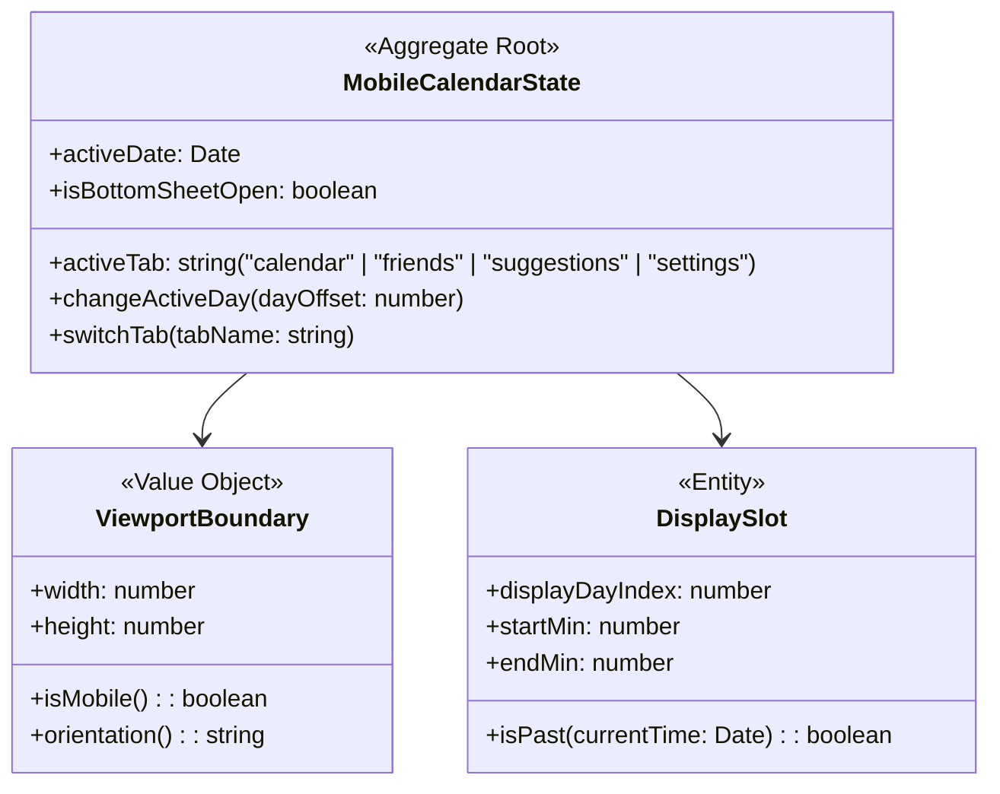

# Product Requirements Document (PRD)
## ArcTime Mobile Portrait Adaptation

This document details the product requirements, Bounded Context, Domain-Driven Design (DDD) models, and Outside-In (London School) Test-Driven Development (TDD) strategy to adapt the ArcTime desktop calendar app into a premium, touch-first mobile portrait interface (viewport width < 768px).

---

## 1. Product Vision & Mobile UX Architecture

The desktop calendar coordination grid is designed for widescreen monitors. On mobile portrait viewports, rendering a 7-day grid alongside a sidebar is unusable. The mobile adaptation shifts the interface to a single-day focus with swipe navigation, bottom sheets, and responsive controls, while preserving the shared real-time database synchronization via Supabase.

```mermaid
graph TD
    subgraph Mobile UI Layout (Portrait)
        NavHeader[Mobile Nav Header: Month/Year Display & Navigation]
        DayPickerBar[Horizontal Day Picker: Scrollable M T W T F S S]
        ActiveTimeline[Single Day Timeline: 24h Vertical Grid]
        BottomNavBar[Bottom Action Bar: Calendar | Friends Hub | Suggestions | Settings]
    end
    
    subgraph Modals & Bottom Sheets
        BottomSheet[Booking & Profile Form: Slide-up Bottom Sheet]
    end

    NavHeader --> DayPickerBar
    DayPickerBar --> ActiveTimeline
    ActiveTimeline --> BottomNavBar
    BottomNavBar --> BottomSheet
```

### Key Mobile Interaction Enhancements
*   **Single-Day Timeline View**: Instead of a 7-day grid, display one active day column. Use horizontal swiping or a top date slider to switch days.
*   **Responsive Bottom Sheets**: Modals and settings drawers transition to native-feeling slide-up bottom sheets (`translateY` animations) that occupy up to 90% of the screen height.
*   **Sticky Bottom Navigation Bar**: Quick-tab switching between Calendar, Friends Hub, Suggestions, and Settings, eliminating the desktop sidebar and header buttons.
*   **Optimized Touch Targets**: Interactive grid slots and buttons are sized to at least `48px x 48px` to comply with mobile accessibility standards.

---

## 2. Domain-Driven Design (DDD) Model

We extend the core ArcTime calendar domain model to incorporate mobile adaptive viewport presentation rules as a separate Bounded Context: `MobileViewportAdaptation`.



### Clean Boundaries & Ubiquitous Language (Mobile)
*   **Active Day**: The single selected calendar day shown in the viewport.
*   **Day Selector Slide**: The horizontal header row showing weekdays and calendar numbers, allowing tap selection of the active day.
*   **Bottom Sheet**: The mobile-adapted form container replacing desktop overlays.
*   **View Tab**: The active presentation mode (Calendar, Friends, Suggestions, Settings).

### Domain Events
*   `ViewportChanged`: Fired when crossing the 768px width boundary.
*   `ActiveDayChanged`: Fired when changing the active day (via swiping or day selector bar).
*   `ViewTabSwitched`: Fired when the active view mode shifts (e.g. from calendar to settings).

---

## 3. Outside-In (London School) TDD Strategy

We will implement code using **London School TDD** (Outside-In / Mockist approach). We begin at the presentation boundary, mocking collaborative domain logic, and verify behavior using unit tests.

### Testing Plan & Mocking Architecture

Because the project runs as a static web application, we will set up Node's native test runner (`node:test`) and assertion library (`node:assert`) to run lightweight, headless tests in the terminal.

```
                  [1. Acceptance/UI Test]
               Verifies Tab Switch / Swipe Day
                             │
                             ▼
               [2. MobilePresenter Controller]
               (Mocks the calendar calculations)
                             │
                             ▼
              [3. Model & Value Object Units]
              (ViewportBoundary / Active Day state)
```

#### Test Suite Specs (to be built under TDD):
1.  **`ViewportBoundary` Specification:**
    *   Verifies that `isMobile()` returns `true` when viewport width is below `768px`.
    *   Verifies that the appropriate CSS class wrapper `.is-mobile` is toggled on `document.body`.
2.  **`MobileCalendarState` Navigation Specification:**
    *   Verifies that `switchTab(tabName)` correctly transitions state and displays only the active container while hiding others.
    *   Verifies that `changeActiveDay(dayOffset)` shifts the active day index between `0` (Monday) and `6` (Sunday).
3.  **Swipe Gesture Detection Specification:**
    *   Verifies that simulated `touchstart` and `touchend` events with horizontal delta offsets trigger `changeActiveDay` events correctly (left swipe = next day, right swipe = previous day).
4.  **Booking Prevention on Past Dates/Slots:**
    *   Verifies that clicks on past days/slots are blocked.
    *   Verifies that the booking modal form displays correct inputs tailored for mobile bottom-sheet display.

---

## 4. UI/UX & Design System

### Mobile CSS Token Overrides
We will add a media query layer (`@media (max-width: 767px)`) in [style.css](file:///home/aarav/Projects/arctime/style.css) containing:
*   **Glassmorphic Navigation Bars**: Sticky bottom nav using `backdrop-filter: blur(12px)` and translucent backgrounds.
*   **Slide-up Animations**: Bottom sheets animated with `transition: transform 0.35s cubic-bezier(0.16, 1, 0.3, 1)`.
*   **Grid layout transformation**: Single column layout replacing the desktop 7-day grid.

### Functional Matrix (Mobile Adaptation)

| Ref | Feature | Mobile Specific Requirement |
| :--- | :--- | :--- |
| **F-MOB-1** | **Bottom Navigation** | Sticky tab bar with 4 actions: Calendar, Friends Hub, Suggestions, and Settings. |
| **F-MOB-2** | **Day Carousel Selector** | Row of weekday circular indicators showing current active day. Tapping switches day. |
| **F-MOB-3** | **Slide-up Bottom Sheets** | Modals and settings drawer slide up from the bottom when triggered. |
| **F-MOB-4** | **Swipe Gestures** | Horizontal swipe gestures on the calendar timeline increment/decrement the selected day. |
| **F-MOB-5** | **Past Booking Block** | Tapping past calendar sections is blocked, with toast feedback. |

---

## 5. Implementation Roadmap

1.  **Review Phase**: Align on this PRD and receive approval.
2.  **TDD Infrastructure Setup**: Add local test files using the built-in Node test runner.
3.  **TDD Stage 1 (Model Units)**: Write unit tests for viewport detection and state transitions; write the code to pass them.
4.  **TDD Stage 2 (Presenter Layer)**: Write tests for swipes, tab switches, and modal bottom sheet overlays; write DOM presenters to pass them.
5.  **Responsive CSS & Markup Injection**: Implement the layout overlays, media queries, animations, and icons.
6.  **Production Verification**: Run the tests and manually verify layout correctness.
